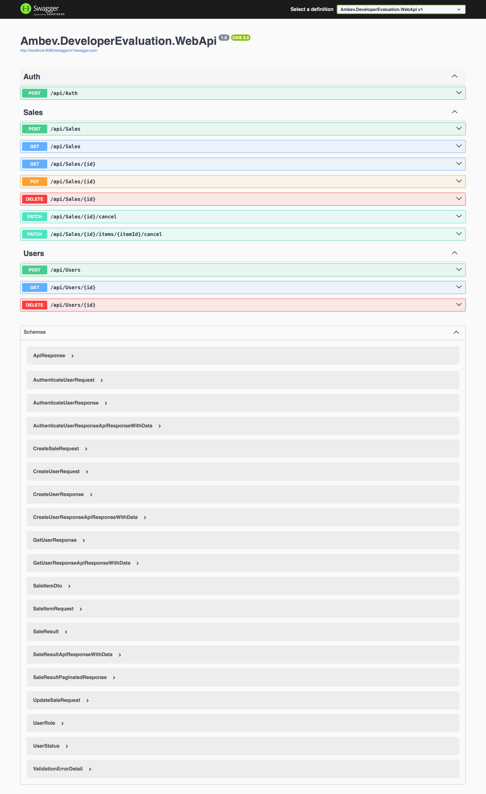

# Testes e Validacao da Entrega

Este documento descreve como validar a API de vendas implementada no desafio.

## 1. Subir dependencias locais

Execute a partir de `template/backend`:

```bash
docker compose up -d ambev.developerevaluation.database ambev.developerevaluation.nosql ambev.developerevaluation.cache
```

## 2. Aplicar migrations

Execute a partir de `template/backend`:

```bash
dotnet restore
dotnet ef database update --project src/Ambev.DeveloperEvaluation.ORM --startup-project src/Ambev.DeveloperEvaluation.WebApi
```

## 3. Rodar a API

Execute a partir de `template/backend`:

```bash
dotnet run --project src/Ambev.DeveloperEvaluation.WebApi
```

Com ambiente `Development`, o Swagger fica disponivel em:

```text
/swagger
```

Evidencia visual:



A raiz da API tambem pode ser usada para uma checagem rapida:

```http
GET /
```

Resposta esperada:

```json
{
  "service": "Ambev.DeveloperEvaluation.WebApi",
  "status": "running",
  "documentation": "/swagger",
  "health": "/health"
}
```

## 4. Rodar testes automatizados

Execute a partir de `template/backend`:

```bash
dotnet test Ambev.DeveloperEvaluation.sln
```

Os testes unitarios cobrem:

- Calculo de desconto com xUnit.
- Massa de dados com Bogus/Faker.
- Mock de dependencias com NSubstitute.
- Publicacao de evento de criacao via `ISaleEventPublisher`.
- Processamento de eventos via Rebus in-memory.

## 5. Criar venda

Endpoint:

```http
POST /api/sales
```

Payload:

```json
{
  "saleNumber": "SALE-0001",
  "saleDate": "2026-05-28T22:00:00Z",
  "customerId": "11111111-1111-1111-1111-111111111111",
  "customerName": "Patrick Otto",
  "branchId": "22222222-2222-2222-2222-222222222222",
  "branchName": "DeveloperStore Sao Paulo",
  "items": [
    {
      "productId": "33333333-3333-3333-3333-333333333333",
      "productName": "Notebook",
      "quantity": 4,
      "unitPrice": 2500
    },
    {
      "productId": "44444444-4444-4444-4444-444444444444",
      "productName": "Mouse",
      "quantity": 2,
      "unitPrice": 100
    }
  ]
}
```

Validar:

- Retorno HTTP `201`.
- Item com `quantity = 4` recebe desconto de 10%.
- Item com `quantity = 2` nao recebe desconto.
- `totalAmount` da venda soma apenas os itens ativos.
- Log/evento `SaleCreatedEvent`.

## 6. Buscar venda por ID

Endpoint:

```http
GET /api/sales/{id}
```

Validar:

- Retorno HTTP `200` para venda existente.
- Retorno HTTP `404` para venda inexistente.
- Resposta contem dados do cliente, filial, itens, descontos, totais e status de cancelamento.

## 7. Listar vendas com paginacao, filtros e ordenacao

Endpoint:

```http
GET /api/sales?page=1&size=10
```

Exemplos:

```http
GET /api/sales?page=1&size=5&isCancelled=false&orderBy=-totalAmount
GET /api/sales?page=1&size=10&saleNumber=SALE
GET /api/sales?page=1&size=10&customerId=11111111-1111-1111-1111-111111111111
GET /api/sales?page=1&size=10&branchId=22222222-2222-2222-2222-222222222222
```

Parametros suportados:

- `page`: pagina atual. Padrao: `1`.
- `size`: tamanho da pagina. Padrao: `10`.
- `saleNumber`: filtro parcial por numero da venda.
- `customerId`: filtro por cliente.
- `branchId`: filtro por filial.
- `isCancelled`: filtro por status de cancelamento.
- `orderBy`: `saleDate`, `-saleDate`, `saleNumber`, `-saleNumber`, `totalAmount`, `-totalAmount`.

Validar:

- Retorno HTTP `200`.
- `currentPage`, `totalPages` e `totalCount` preenchidos.
- Filtros retornam apenas registros esperados.
- Ordenacao respeita o campo solicitado.

## 8. Atualizar venda

Endpoint:

```http
PUT /api/sales/{id}
```

Use o mesmo formato de payload do `POST /api/sales`.

Validar:

- Retorno HTTP `200`.
- Dados da venda atualizados.
- Itens substituidos e totais recalculados.
- Log/evento `SaleModifiedEvent`.

## 9. Cancelar item

Endpoint:

```http
PATCH /api/sales/{id}/items/{itemId}/cancel
```

Validar:

- Retorno HTTP `200`.
- Apenas o item informado fica com `isCancelled = true`.
- Total do item cancelado fica `0`.
- Total da venda e recalculado com os itens restantes.
- Log/evento `ItemCancelledEvent`.

## 10. Cancelar venda

Endpoint:

```http
PATCH /api/sales/{id}/cancel
```

Validar:

- Retorno HTTP `200`.
- Venda fica com `isCancelled = true`.
- Todos os itens ficam com `isCancelled = true`.
- Total da venda fica `0`.
- Log/evento `SaleCancelledEvent`.

## 11. Deletar venda

Endpoint:

```http
DELETE /api/sales/{id}
```

Validar:

- Retorno HTTP `200` para venda existente.
- Retorno HTTP `404` ao buscar ou deletar novamente o mesmo ID.

## 12. Matriz das regras de negocio

| Quantidade | Resultado esperado |
| --- | --- |
| 1 | 0% de desconto |
| 3 | 0% de desconto |
| 4 | 10% de desconto |
| 5 | 10% de desconto |
| 9 | 10% de desconto |
| 10 | 20% de desconto |
| 15 | 20% de desconto |
| 20 | 20% de desconto |
| 21 | Requisicao rejeitada |

## 13. Checklist de aderencia

- PostgreSQL com EF Core.
- Mapeamento via Fluent API.
- Dominio sem Data Annotations.
- Entidades com `private set`.
- External Identities para cliente, filial e produto.
- MediatR para comandos e consultas.
- FluentValidation no fluxo de entrada.
- Rebus in-memory na camada de servico para eventos.
- Application log para eventos de venda.
- CRUD completo.
- Paginacao, filtros e ordenacao.
- Faker/Bogus para massa de teste.
- NSubstitute para mocks.
- xUnit para testes unitarios.
